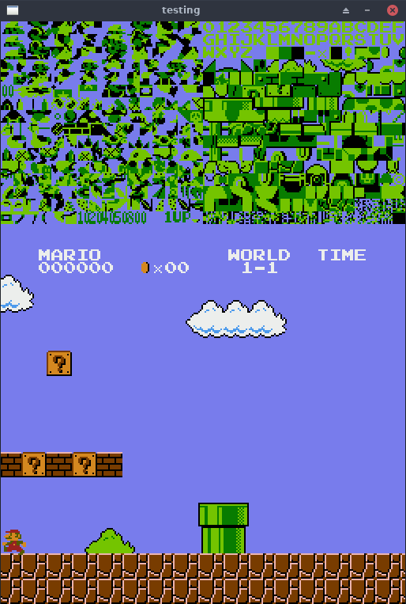

# NES-emulator
a simple NES emualtor written in C, has a debugging interface that displays the pattern tables

### Building
- to build the project run ```cmake CMakeLists.txt``` and then ```make <makefileName>```

### working on 
- apu
- refactoring the project 
- perfecting the ppu
- debugging interface

### implemented mappers
-mapper 0


